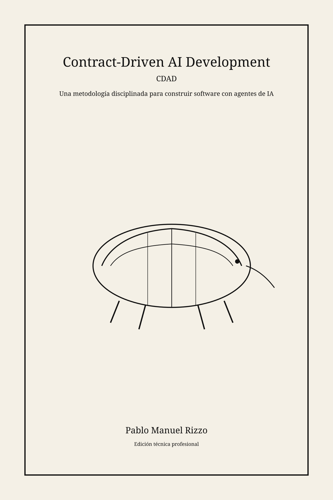
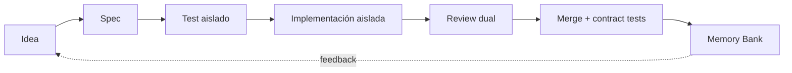

# Créditos

**Autor:** Pablo Manuel Rizzo  
**Edición técnica:** IA asistida  
**Edición:** 2026

---

# Prólogo

Este libro propone una idea simple y poderosa: cuando trabajamos con agentes de IA, la calidad no debe depender de la consistencia del modelo, sino de un sistema de barreras verificables.

> **Idea rectora:** el agente que implementa no puede ser el único que valida.

# Introducción

El texto base de este libro surge de `CDAD_metodologia.md` y fue transformado a formato editorial con organización de lectura continua, partes destacadas, diagramas y anexos de aplicación práctica.

## Cómo usar este libro

- Si estás empezando: léelo de principio a fin.
- Si ya usás IA en desarrollo: empieza por el ciclo operativo y vuelve a fundamentos cuando lo necesites.

---

# Parte I — Fundamentos

## Capítulo 1. Por qué CDAD existe

CDAD nace para resolver un problema recurrente: la variabilidad de resultados de modelos generativos cuando no existe estructura de control.

### Punto clave

> Las barreras estructurales reemplazan control manual frágil por validación repetible.

## Capítulo 2. Cinco principios fundacionales

1. Spec antes que código.  
2. Contratos verificables.  
3. TDD anti-trampa con sesiones aisladas.  
4. Review en dos capas.  
5. Memory Bank evolutivo.

### Caja destacada: Error común

**Error:** dejar que el mismo agente escriba test e implementación con contexto completo.  
**Efecto:** tests débiles alineados al código, no al contrato.

## Capítulo 3. CDAD vs alternativas

Comparación práctica entre vibe coding, TDD clásico y CDAD completo según criticidad, vida útil y costo de bug.

---

# Parte II — Ejecución Operativa

## Capítulo 4. El ciclo completo



## Capítulo 5. Descubrimiento

Objetivo: capturar intención funcional y restricciones reales de negocio antes de redactar contrato.

## Capítulo 6. Especificación

Formato mínimo recomendado:
- Descripción funcional
- Firma/contrato
- Postcondiciones
- Invariantes
- Criterios de aceptación
- Out of scope

## Capítulo 7. TDD anti-trampa

Separación estricta entre generación de pruebas e implementación para evitar auto-validación circular.

### Ejemplo breve

```python
# test_contract_parser.py
@pytest.mark.parametrize("s", valid_iso_cases)
def test_parser_accepts_valid_iso(s):
    dt = parse_iso_date(s)
    assert dt is not None
```

## Capítulo 8. Review en dos capas

- Capa 1: cumplimiento funcional contra spec.
- Capa 2: calidad arquitectónica y deuda técnica.

## Capítulo 9. Merge y Memory Bank

Documentar:
- decisiones técnicas,
- trade-offs,
- riesgos remanentes,
- próximos pasos.

---

# Parte III — Implementación Avanzada

## Capítulo 10. Configuración de herramientas

Checklist:
- lint,
- type-check,
- tests unitarios,
- contract tests parametrizados,
- pipeline CI.

## Capítulo 11. CDAD en frameworks opinados

Adaptaciones para entornos como Django, Odoo, Rails o Spring, preservando contratos como capa estable.

## Capítulo 12. Anti-patrones

- “Spec retroactivo” (escribirlo después de implementar).
- “Test complaciente”.
- “Review superficial por fatiga”.

## Capítulo 13. Referencia rápida

Incluye glosario, checklist y guía de adopción incremental.

---

# Diagramas adicionales

Ver carpeta `diagrams/`.

---

# Anexo A — Plantilla de Spec CDAD

```markdown
# Spec: <feature>
## Descripción funcional
## Contrato
## Postcondiciones
## Invariantes
## Criterios de aceptación
## Out of scope
```

# Anexo B — Checklist de publicación

- [ ] Coherencia terminológica
- [ ] Diagramas legibles
- [ ] Ejemplos ejecutables
- [ ] Índice actualizado
- [ ] Exportaciones PDF/EPUB verificadas

---

# Nota editorial

Este manuscrito está preparado para edición profesional y maquetación final. El contenido completo original se conserva en `chapters/01-13-base.md` como fuente maestra para expansión capítulo por capítulo.
