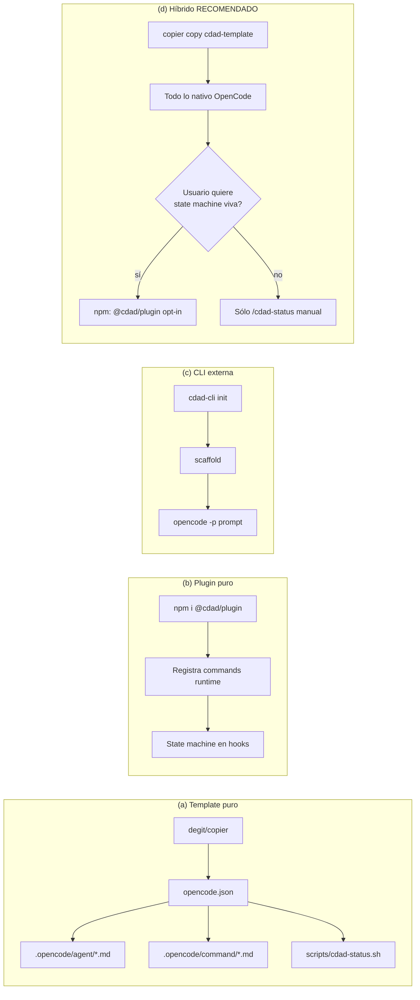
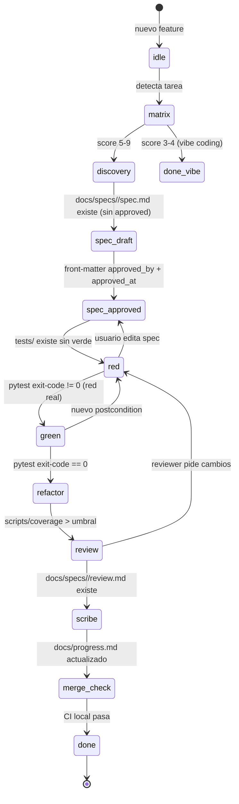

# CDAD × OpenCode — Estrategia de Implementación

> Investigación y recomendación sobre cómo materializar la metodología **Contract-Driven AI Development (CDAD)** dentro de **OpenCode** (https://opencode.ai), con doble track *base genérica + preset Odoo* y nivel de automatización medio (comandos + state machine sugerente, no wizard bloqueante).

---

## TL;DR (3 bullets)

- **Recomendación principal**: **opción híbrida** — un **template de proyecto `cdad-template`** (clonable con `degit`/`copier`) que despliega *todo lo nativo de OpenCode* (subagentes en `.opencode/agent/*.md`, comandos slash en `.opencode/command/*.md`, `AGENTS.md` jerárquico, `opencode.json` con permisos por glob, skills y MCP), **acompañado de un plugin TypeScript opcional muy fino (`cdad-plugin`)** que sólo aporta la state machine via hooks `session.created` y `tool.execute.after`. Esto evita el lock‑in fuerte de la opción "plugin puro", sigue funcionando aunque el plugin esté desactivado, y permite actualizar la metodología sin tocar el repo del usuario (vía `copier update`).
- **Lo que es viable HOY en OpenCode** (verificado en docs oficiales): subagentes Markdown con `permission.edit` por glob (allow/deny/ask), comandos slash con `$ARGUMENTS`/`@file`/`!shell`/`subtask: true`, plugins TypeScript con 25+ eventos de ciclo de vida (`session.created`, `session.idle`, `tool.execute.before/after`, `file.edited`, `permission.ask`…), MCP servers, LSP configurable, AGENTS.md anidado por subdirectorio. **Lo que NO existe nativamente y requiere workaround**: un "init de proyecto desde template" (no hay `opencode init --template`), system prompts dinámicos (issue #3195 abierto), y un mecanismo confiable de "mensaje al abrir el proyecto" — para esto último el plugin con `session.created` + `client.session.prompt` es el camino correcto.
- **Preset Odoo**: estructura `modules/<addon>/{models,views,security,data,tests}` + `_inherit` como mecanismo de "contrato extensible" (en lugar de `Protocol`), pre‑commit con `pylint-odoo` + `oca-checks-odoo-module` (OCA), tests `TransactionCase`/`HttpCase` con `@tagged`, contract tests parametrizados que recorren `env['model'].search([])` y aplican invariantes a cada extensión registrada, y un docker-compose para correr `odoo-bin --test-tags` desde `/cdad:merge-check`.

---

## Recomendación principal (justificada)

Después de evaluar las tres opciones contra las capacidades reales de OpenCode (v1.4.x, abril 2026, fork mantenido por anomalyco) y contra criterios de mantenibilidad a largo plazo:

| Criterio | (a) Template puro | (b) Plugin puro | (c) CLI externa | **(d) Híbrido** |
|---|---|---|---|---|
| Esfuerzo inicial | Bajo | Medio-alto | Alto | Medio |
| Lock-in con API OpenCode | Mínimo | **Alto** (API plugin) | Mínimo | Bajo |
| Update centralizado de la metodología | Manual (copier update) | Sí (npm) | Sí | **Sí** (template+npm) |
| State machine "viva" (sugiere etapa al abrir) | No (sólo `/cdad:status`) | Sí (`session.created`) | Sí (wrapper) | **Sí** (plugin opcional) |
| Funciona si la API de plugin cambia | Sí | **No** | Sí | **Sí** (degrada elegantemente) |
| Experiencia integrada | Media | Alta | Baja | **Alta** |
| Doble track Odoo | Trivial (`--preset=odoo`) | Trivial (config) | Trivial | **Trivial** |
| Curva de adopción para nuevo usuario | Baja | Baja | Media (dos herramientas) | Baja |

**Veredicto: opción (d) Híbrido**. Concretamente:

1. **Producto principal**: `cdad-template` — un repo template scaffold-eable con [`copier`](https://github.com/copier-org/copier) (mismo enfoque que usa OCA con `oca-addons-repo-template`). Este es el "producto" que el usuario clona el lunes. Contiene todo lo nativo de OpenCode preconfigurado: subagentes, comandos slash, AGENTS.md, scripts, pre-commit, ADR/specs templates, Memory Bank.
2. **Producto accesorio (opcional)**: `cdad-plugin` — un plugin TypeScript publicado en npm. Sólo hace dos cosas: (a) en `session.created`, lee `docs/.cdad-state.json` y *imprime* el siguiente paso sugerido (no bloquea); (b) en `tool.execute.after`, recalcula el estado cuando cambian archivos clave. Sin el plugin, todo sigue funcionando — sólo se pierde la sugerencia automática en cada sesión y el usuario debe correr `/cdad:status` a mano.
3. **Extensiones futuras**: si surge un protocolo `opencode init --template` oficial, pivotar es trivial; si la API de plugin rompe, la metodología no se cae.

Por qué *no* CLI externa (c): obliga al usuario a alternar entre dos herramientas; OpenCode ya tiene primitivos suficientes (commands, agents, plugins, skills, MCP) para que no tenga sentido replicar lógica afuera. Por qué *no* plugin puro (b): la API de plugins de OpenCode es joven (paquete `@opencode-ai/plugin`, releases muy frecuentes, fork reciente sst→anomalyco); jugarse toda la metodología a esa API es frágil. Por qué *no* template puro (a): perdés la *state machine en vivo* al abrir, que es uno de los requisitos explícitos.

---

## 1. Capacidades técnicas de OpenCode (verificadas en docs y código)

> Distinción clara entre **soporte nativo HOY** vs. **workaround necesario**.

### 1.1 Subagentes — soporte nativo, suficiente

- **Definición**: archivos Markdown con YAML frontmatter en `.opencode/agent/<name>.md` (proyecto) o `~/.config/opencode/agent/<name>.md` (global). Tanto `agent/` (singular) como `agents/` (plural) están aceptados; los docs oficiales usan plural. El nombre del archivo es el nombre del agente.
- **Frontmatter soportado**:
  ```yaml
  ---
  description: ...        # requerido
  mode: subagent          # primary | subagent | all
  model: anthropic/claude-sonnet-4-5
  temperature: 0.2
  permission:
    edit:
      "*": deny
      "tests/**": allow
    bash:
      "git status*": allow
      "rm *": deny
    webfetch: deny
  tools:
    write: false          # deprecated; preferir permission.edit
  hidden: false
  color: "#7C3AED"
  ---
  Eres un test-writer estricto en CDAD...
  ```
- **Permisos granulares por glob**: SÍ. La clave `permission.edit` (y otras como `read`, `bash`) acepta un mapa de **patrón → acción** (`allow`/`ask`/`deny`). Las reglas se evalúan en orden con la **última que matchea ganando** — patrón típico es poner `"*": "deny"` primero y reglas específicas después.
- **`deny` por glob es real**, *pero* hay un caveat reportado: issue #13872 muestra que `"src/**/*": "allow"` a veces no se respeta sin patrones más específicos; conviene incluir `"src/**": "allow"` además de `"src/**/*": "allow"` y testear cada agente al inicio.
- **Modelo distinto por subagente**: SÍ, vía clave `model` con formato `provider/model-id`. Si no se especifica, los subagentes heredan el modelo del agente primario que los invocó.
- **Invocación**: por `@nombre-agente` (manual), por descripción desde un agente primario (vía Task tool), o forzados desde un comando slash con `subtask: true`.
- **Aislamiento de contexto**: SÍ. Un subagente abre una *child session* sin ver el contexto del padre, lo cual es exactamente lo que CDAD necesita para sesiones aisladas.

### 1.2 Comandos slash — soporte nativo, suficiente

- **Definición**: archivos Markdown en `.opencode/command/<name>.md` o `~/.config/opencode/command/<name>.md`. El filename = nombre del comando (`/cdad-init` desde `cdad-init.md`).
- **Frontmatter**:
  ```yaml
  ---
  description: Inicializa el ciclo CDAD para una feature
  agent: architect          # opcional: invoca este agente
  model: anthropic/claude-opus-4
  subtask: true             # opcional: fuerza child session aislada
  ---
  ```
- **Placeholders soportados** en el body:
  - `$ARGUMENTS` (todos los argumentos juntos)
  - `$1`, `$2`, ... (posicional)
  - `$NAMED_ARG` (argumentos nombrados que prompean al usuario)
  - `@path/to/file.md` (incluye el contenido del archivo)
  - `` !`comando shell` `` (ejecuta el comando y inyecta su stdout)
- **Ejecutar scripts del repo desde un comando**: SÍ, vía el `!`...`` placeholder. Ejemplo: `` !`./scripts/cdad-status.sh` ``.
- **Comandos pueden override builtins**. `/init` ya existe (genera `AGENTS.md`); por eso usaremos namespace `/cdad-*` y NO sobreescribimos `/init`.

### 1.3 Sistema de plugins — soporte nativo, viable pero joven

- **API**: paquete npm `@opencode-ai/plugin`, plugin = función TypeScript/JavaScript async que recibe `{ project, client, $, directory, worktree }` y retorna un objeto de hooks.
- **Ubicación**: `.opencode/plugin/*.ts` (proyecto), `~/.config/opencode/plugin/*.ts` (global), o vía npm con `"plugin": ["@org/cdad-plugin"]` en `opencode.json`. OpenCode corre `bun install` automáticamente al startup.
- **Eventos disponibles** (subset relevante):
  - `session.created`, `session.idle`, `session.compacted`, `session.deleted`, `session.error`
  - `message.updated`, `message.part.updated`
  - `file.edited`, `file.watcher.updated`
  - `tool.execute.before`, `tool.execute.after`
  - `permission.ask`, `permission.replied`
  - `command.executed`
- **Hooks adicionales** (no estrictamente "events"): `chat.message`, `chat.params`, `config`, `auth`, `tool` (registrar custom tools), `shell.env` (inyectar env vars).
- **Limitación conocida** (issue #14808, abr 2026): el evento `session.created` no siempre se dispara como esperan los plugins en algunas builds. **Workaround**: además de `session.created`, registrar un hook en `message.updated` que detecte el primer mensaje del usuario y dispare la lógica de bootstrap.
- **Limitación conocida**: NO hay un hook `pre-session-prompt` que permita modificar dinámicamente el system prompt antes del primer turno (issue #3195 abierto). Esto significa que la *sugerencia* del plugin debe llegar como un mensaje del asistente o como contenido inyectado al system prompt al recargar — está bien para el nivel de automatización medio que pide el usuario.

### 1.4 MCP — soporte nativo, robusto

- Configuración en `opencode.json` bajo clave `mcp`. Soporta servers `local` (con `command`, `environment`) y `remote` (con `url`, `headers`, OAuth automático con Dynamic Client Registration RFC 7591).
- **Habilitación por agente**: se puede deshabilitar globalmente y rehabilitar por subagente con `tools` o `permission` matcheando el prefijo `<servername>_*`.

### 1.5 LSP — soporte nativo, con caveats

- 30+ servers preconfigurados (TypeScript, Python/Pyright, Go, Rust, etc.). Se auto-instalan al detectar la extensión de archivo. Configurables en `opencode.json` bajo `lsp`.
- **Caveat para Python/Odoo**: issue #6131 reporta que el LSP Pyright no resuelve siempre el venv en monorepos. Para Odoo conviene declarar `pyrightconfig.json` con `venvPath` + `venv` y, si hace falta, usar `basedpyright` invocado vía bash desde el reviewer en lugar de depender exclusivamente del LSP.

### 1.6 AGENTS.md jerárquico — soporte nativo

- **Carga automática** de `AGENTS.md` desde la raíz del proyecto y desde subdirectorios cuando se trabaja en ellos. Compatible con `CLAUDE.md` como fallback.
- **Instrucciones extra**: clave `instructions` en `opencode.json` acepta un array de paths/globs (ej. `["docs/*.md", "packages/*/AGENTS.md"]`) que se concatenan al contexto. **Esto es la base ideal para el Memory Bank**: `instructions: ["docs/projectbrief.md", "docs/systemPatterns.md", "docs/activeContext.md", "docs/progress.md"]`.

### 1.7 Skills — soporte nativo (útil pero opcional)

- Carpetas `.opencode/skill/<name>/SKILL.md` con frontmatter `name` + `description`. Se cargan **on-demand** por el agente cuando juzga relevante. Útiles para CDAD: skills `red-phase`, `green-phase`, `refactor-phase`, `odoo-test-writing` que documentan reglas detalladas sin saturar el contexto inicial.

### 1.8 Templates / scaffolding — **NO nativo**

- OpenCode no tiene `opencode init --template <repo>`. El comando `/init` sólo *genera/actualiza un `AGENTS.md`* analizando el repo existente. **Workaround**: el bootstrap se hace fuera (con `copier copy`, `degit`, o un script `cdad-init.sh`) y *después* el usuario abre OpenCode dentro.

### 1.9 Madurez del proyecto

- Repo principal: **`anomalyco/opencode`** (ex `sst/opencode`, fork desde feb 2026). 152k stars, 17.6k forks. Releases casi diarios — hay propuesta abierta (issue #14358) de canales nightly/beta/stable porque el ritmo causa fricción. **v1.x estable** desde noviembre 2025; el badge "Beta" del social share fue retirado. Existe `anomalyco/opencode-beta` para builds tempranas.
- Implicación práctica para CDAD: pinear la versión en `package.json` del template (`"opencode-ai": "^1.4.0"`) y testear el template contra cada release minor antes de publicar.

---

## 2. Comparativa profunda de las formas de empaquetar (recap visual)



Detalles ya cubiertos en la tabla del capítulo de Recomendación. La opción (d) es la única que (i) sobrevive cambios de la API plugin sin romper el flujo principal, (ii) puede actualizarse con `copier update --UNSAFE`, y (iii) ofrece state machine viva para los usuarios que la quieran.

---

## 3. State machine del ciclo CDAD

### 3.1 Estados, archivos detectores y transiciones



### 3.2 Detectores concretos (lo que mira la state machine)

| Estado | Condición de entrada (todas requeridas) |
|---|---|
| `idle` | No existe `docs/specs/<active-feature>/` |
| `matrix` | Existe `docs/specs/<feat>/matrix.json` con score |
| `discovery` | `discovery.md` existe; `spec.md` no |
| `spec_draft` | `spec.md` existe; sin frontmatter `approved_by` o `approved_at: null` |
| `spec_approved` | `spec.md` con `approved_by: <user>` y `approved_at: <ISO>` |
| `red` | Hay archivos en `tests/<feat>/` modificados después del spec; `pytest tests/<feat> --tb=no -q` retorna ≠ 0 |
| `green` | `pytest tests/<feat>` retorna 0; coverage del feature aún no medida |
| `refactor` | `green` + último commit con prefijo `refactor:` ó cambios en `src/` sin cambios en `tests/<feat>/` |
| `review` | Existe `docs/specs/<feat>/review.md` |
| `scribe` | `review.md` aprobado + `docs/progress.md` o `docs/activeContext.md` modificados |
| `merge_check` | `scripts/cdad-merge-check.sh` exit-code 0 |
| `done` | Branch mergeado a main + ADR creado si aplica |

### 3.3 Persistencia del estado

`docs/.cdad-state.json` (versionado en git):

```jsonc
{
  "$schema": "./.cdad-state.schema.json",
  "active_feature": "invoicing-eu-vat",
  "mode": "full",                 // vibe | light | full (de la matriz)
  "matrix": { "useful_life": 7, "bug_cost": 8, "evolution": 6 },
  "stage": "red",
  "stage_history": [
    { "stage": "spec_approved", "at": "2026-04-29T10:01Z", "by": "human:juan" },
    { "stage": "red", "at": "2026-04-29T10:23Z", "by": "subagent:test-writer" }
  ],
  "next_action": {
    "command": "/cdad-green",
    "rationale": "Hay 3 tests rojos en tests/invoicing-eu-vat/. Invocá implementer para hacerlos pasar uno a uno."
  },
  "open_postconditions": [
    "PC-3: cálculo IVA reverse-charge intra-EU",
    "PC-4: redondeo a 2 decimales por línea"
  ]
}
```

La regla de oro: **el archivo es derivable de las convenciones del repo**. `cdad-status` lo regenera siempre; el JSON sólo es un caché para sesiones rápidas y para que el plugin lo lea sin recomputar. Si el JSON desaparece, el sistema se reconstruye solo.

### 3.4 Lecciones de herramientas similares

- **pre-commit / husky**: hooks como guardas, no como orquestadores. Lección: *no bloquear flujos legítimos*; la state machine sólo *sugiere*.
- **semantic-release**: estado derivado del git log + convenciones. Lección: derivar antes que persistir; el archivo es caché, no fuente de verdad.
- **cc-sdd / Spec Kit / Kiro / Advance**: usan *gated stages* con artefactos en disco (spec.md → tasks.md → impl). Lección: cada transición produce un artefacto persistente revisable.
- **Robustez a saltos no lineales**: el detector siempre re-evalúa todos los archivos; el `stage_history` permite auditar el zig-zag pero la transición es válida si el detector matchea, sin importar el estado anterior.

---

## 4. Subagentes CDAD concretos para OpenCode

Todos en `.opencode/agent/`. Modelos sugeridos asumen que el usuario tiene Claude (Sonnet/Opus) + un modelo "rápido" tipo Haiku/Gemini Flash; ajustar al gusto.

### 4.1 `architect.md` — descubrimiento + brainstorm socrático

```yaml
---
description: Etapa 1-2 CDAD. Descubrimiento socrático y redacción de spec con postcondiciones verificables. Plan-only, no escribe código.
mode: subagent
model: anthropic/claude-opus-4-5
temperature: 0.4
permission:
  edit:
    "*": deny
    "docs/specs/**/*.md": allow
    "docs/landscape.md": allow
    "docs/adr/**/*.md": allow
  bash:
    "git status*": allow
    "git log*": allow
    "grep *": allow
    "*": deny
  webfetch: allow
color: "#3B82F6"
---
Sos el architect de un proyecto CDAD. Tu trabajo es:

1. Hacer preguntas socráticas hasta que la postcondición sea verificable (NO `obvio` o `intuitivo`).
2. Redactar `docs/specs/<feature>/spec.md` con secciones: Contexto, Postcondiciones (numeradas PC-1, PC-2...), Criterios de aceptación, Riesgos, Out-of-scope.
3. NUNCA escribir código fuente. Si el usuario pide implementación, recordále que falta aprobación humana del spec (front-matter `approved_by`).
4. Leé al inicio: docs/projectbrief.md, docs/systemPatterns.md, docs/activeContext.md, docs/landscape.md.
5. Si una postcondición depende de otra, marcala como "acoplada" y agrupala. Las ortogonales se pueden testear en paralelo.
```

### 4.2 `test-writer.md` — RED

```yaml
---
description: Escribe tests que fallan por la razón correcta. Sólo edita en tests/. Ley de Hierro CDAD.
mode: subagent
model: anthropic/claude-sonnet-4-5
temperature: 0.1
permission:
  edit:
    "*": deny
    "tests/**": allow
    "docs/specs/**/*.md": allow
  bash:
    "pytest tests/*": allow
    "git status*": allow
    "*": ask
color: "#EF4444"
---
Sos el test-writer. Reglas estrictas:

1. Lee `docs/specs/<feature>/spec.md` y elegí UNA postcondición no implementada.
2. Si es ortogonal a otras, podés agrupar varios tests; si está acoplada, una sola asserción por test.
3. Escribí el test ANTES que cualquier código. Corre `pytest tests/<feature>/` y CONFIRMÁ que el test falla por la razón correcta (mensaje de error coherente con la postcondición, no por ImportError trivial).
4. NUNCA edites archivos en `src/`. Si necesitás un stub, dejá un `# TODO: implementer` en spec, no en código.
5. Para invariantes verificables sobre todas las implementaciones de un Protocol/interface, usá `@pytest.mark.parametrize` con los registry de implementaciones + `hypothesis` para property tests.
6. Reportá los tests rojos creados con paths absolutos al final del turno.
```

### 4.3 `implementer.md` — GREEN

```yaml
---
description: Hace pasar tests rojos con el código mínimo. Sólo edita en src/.
mode: subagent
model: anthropic/claude-sonnet-4-5
temperature: 0.0
permission:
  edit:
    "*": deny
    "src/**": allow
  bash:
    "pytest tests/*": allow
    "ruff check src/*": allow
    "*": ask
color: "#22C55E"
---
Sos el implementer. Reglas:
1. Leé los tests rojos primero. NUNCA edites archivos de tests.
2. Implementá el código MÍNIMO para que pasen los tests específicos. No anticipes futuros requirements (YAGNI).
3. Corré `pytest tests/<feature>/` después de cada cambio.
4. Si un test no pasa después de 3 intentos en la misma estrategia, parate, escribí en `docs/specs/<feat>/blockers.md` y pedí ayuda.
5. NO modifiques tests para que pasen. Si un test parece incorrecto, escribí una nota en `docs/specs/<feat>/test-doubts.md` y volvé al architect.
```

### 4.4 `refactorer.md` — REFACTOR

```yaml
---
description: Mejora estructura sin cambiar comportamiento. Mantiene tests verdes.
mode: subagent
model: anthropic/claude-sonnet-4-5
temperature: 0.1
permission:
  edit:
    "*": deny
    "src/**": allow
  bash:
    "pytest *": allow
    "ruff *": allow
color: "#A855F7"
---
Sos el refactorer. Reglas:
1. Antes de empezar, corré la suite completa y guardá el resultado.
2. Después de cada cambio, corré la suite. Si pasa de verde a algo distinto, REVERTÍ inmediatamente.
3. NUNCA cambies un test, ni un nombre público de función o clase sin marcar la regla en `docs/systemPatterns.md`.
4. Refactors permitidos: extraer función, renombrar local, mover archivo dentro de un módulo, simplificar condicional, eliminar duplicación.
```

### 4.5 `reviewer.md` — read-only, modelo distinto

```yaml
---
description: Code review de los cambios pendientes. Read-only. Modelo distinto al implementer para diversidad de criterio.
mode: subagent
model: openai/gpt-5.1-codex          # u opencode/gpt-5.1-codex via OpenCode Zen
temperature: 0.2
permission:
  edit:
    "*": deny
    "docs/specs/**/review.md": allow
  bash:
    "git diff*": allow
    "git log*": allow
    "pytest *": allow
    "ruff check*": allow
    "pylint*": allow
    "*": deny
  webfetch: deny
color: "#F59E0B"
---
Sos el reviewer. Modelo distinto al implementer a propósito (diversidad de criterio). 
1. Leé `docs/specs/<feat>/spec.md` y `git diff main...HEAD`.
2. Verificá: cobertura de postcondiciones (cada PC debe tener ≥1 test), tests no acoplados a implementación, naming, complejidad ciclomática, manejo de errores.
3. Generá `docs/specs/<feat>/review.md` con secciones:
   - **Bloqueantes** (deben corregirse antes de merge)
   - **Importantes** (corregir si hay tiempo)
   - **Nitpicks** (opcionales)
4. Para cada hallazgo: archivo, línea, justificación, sugerencia accionable.
5. Recordá: la decisión final es humana. Vos priorizás; el humano valida.
```

### 4.6 `scribe.md` — Memory Bank update

```yaml
---
description: Drafta updates del Memory Bank al cierre del feature. Read-only excepto en docs/.
mode: subagent
model: anthropic/claude-haiku-4-5
temperature: 0.3
permission:
  edit:
    "*": deny
    "docs/activeContext.md": allow
    "docs/progress.md": allow
    "docs/systemPatterns.md": allow
    "docs/.cdad-state.json": allow
  bash:
    "git log*": allow
    "git diff*": allow
color: "#06B6D4"
---
Sos el scribe. Tu trabajo es mantener el Memory Bank al día.
1. Leé git log del feature, spec.md, review.md.
2. Drafteá un update de docs/progress.md (qué se hizo, qué quedó pendiente, decisiones).
3. Si surgió un patrón generalizable, propone un párrafo nuevo para docs/systemPatterns.md.
4. Limpiá docs/activeContext.md (sacá lo del feature cerrado, mové lo aprendido a systemPatterns).
5. Actualizá docs/.cdad-state.json a stage: "done".
6. NUNCA modifiques código fuente ni tests.
```

### 4.7 Variantes Odoo

`.opencode/agent/odoo-test-writer.md`:

```yaml
---
description: Test-writer especializado en Odoo. TransactionCase/HttpCase, fixtures con env.ref, _inherit.
mode: subagent
model: anthropic/claude-sonnet-4-5
temperature: 0.1
permission:
  edit:
    "*": deny
    "modules/*/tests/**": allow
    "docs/specs/**/*.md": allow
  bash:
    "docker compose run --rm odoo *": allow
    "git status*": allow
color: "#A855F7"
---
Sos el test-writer Odoo. Reglas adicionales:

1. Tests viven en `modules/<addon>/tests/test_*.py` y se importan desde `modules/<addon>/tests/__init__.py`.
2. Usá `from odoo.tests import TransactionCase, HttpCase, tagged`.
3. Para tests que dependan de toda la app instalada: `@tagged('-at_install', 'post_install')`.
4. Para contract tests sobre extensiones de un modelo (`_inherit`), parametrizá iterando `self.env.registry.descendants('base.model')` o equivalente, y aplicá la invariante en cada uno.
5. setUp con `setUpClass` y `cls.env['model'].create({...})` para fixtures.
6. NUNCA modifiques `__manifest__.py`, `models/`, `views/`, `security/`. Eso es del implementer.
7. Para correr: `docker compose run --rm odoo odoo-bin -d testdb -i <addon> --test-tags=/<addon> --stop-after-init --test-enable`.
```

`.opencode/agent/odoo-implementer.md` simétricamente: `permission.edit` = `{"*": "deny", "modules/*/models/**": "allow", "modules/*/views/**": "allow", "modules/*/security/**": "allow", "modules/*/data/**": "allow", "modules/*/__manifest__.py": "allow"}` y `"modules/*/tests/**": "deny"`.

---

## 5. Comandos slash propuestos

Todos en `.opencode/command/cdad-*.md`. Convención: namespace `cdad-` (en lugar de `/cdad:foo`, OpenCode usa kebab-case y la rama `:` no funciona como subnamespace nativo; para mantener legibilidad ponemos prefijo).

### 5.1 `cdad-init.md`

```yaml
---
description: Convierte el directorio actual en proyecto CDAD (estructura + AGENTS.md + agentes + scripts)
agent: build
---
Ejecutá el script de bootstrap CDAD para este directorio:

!`bash scripts/cdad/bootstrap.sh ${1:-generic}`

Después leé el output, listá los archivos creados, y proponé al usuario los siguientes pasos:
- Editar `docs/projectbrief.md` (es la fuente de verdad de "qué estamos construyendo")
- Correr `/cdad-status` para ver el estado actual
- Correr `/cdad-matrix` cuando tengas una primera tarea para puntuar
```

> Como OpenCode no soporta scaffolding nativo, este comando asume que el repo ya tiene `scripts/cdad/bootstrap.sh` (lo cual es cierto cuando el usuario clonó `cdad-template`). Si quiere "convertir" un repo existente, primero debe correr `copier copy https://github.com/<user>/cdad-template . --trust`.

### 5.2 `cdad-status.md`

```yaml
---
description: Muestra el estado actual del ciclo CDAD y la próxima acción sugerida
---
Estado actual del proyecto CDAD:

!`bash scripts/cdad/status.sh`

Basate en el output anterior y en @docs/.cdad-state.json para resumir:
1. Feature activa
2. Etapa actual del ciclo (con emoji visual)
3. Próximo comando sugerido y por qué
4. Cualquier bloqueante detectado
```

### 5.3 `cdad-matrix.md`

```yaml
---
description: Puntúa la tarea en la matriz observable (vida útil, costo bug, evolución) y sugiere modo
agent: architect
---
Hacele al usuario las 3 preguntas de la matriz CDAD para la tarea: "$ARGUMENTS"

1. **Vida útil esperada** (1=código throwaway, 9=10+ años producción): ?
2. **Costo de un bug** (1=trivial, 9=catastrófico, dinero/datos/seguridad): ?
3. **Probabilidad de evolución** (1=nunca cambia, 9=cambios mensuales): ?

Después de obtener los 3 scores:
- Calculá el promedio (3-9)
- Sugerí modo: 3-4 vibe coding, 5-6 CDAD light, 7-9 CDAD completo
- Guardá en `docs/specs/<feat>/matrix.json` y actualizá `docs/.cdad-state.json`
- Si modo es vibe, recordale al usuario que igual conviene un mini-spec en un comentario del código
```

### 5.4 `cdad-discover.md`

```yaml
---
description: Etapa 1 - Descubrimiento. Architect explora el código y pregunta lo que falta.
agent: architect
subtask: true
---
Ejecutá la etapa de descubrimiento para la feature: "$ARGUMENTS"

1. Leé docs/projectbrief.md, docs/systemPatterns.md, docs/landscape.md.
2. Explorá el código relevante con grep/glob.
3. Hacé al usuario las preguntas necesarias para entender el "porqué" antes que el "cómo".
4. Generá `docs/specs/$ARGUMENTS/discovery.md` con: contexto del usuario, restricciones técnicas, sistemas adyacentes afectados, hipótesis a validar.
5. NO escribas todavía el spec — eso es la siguiente etapa.
```

### 5.5 `cdad-spec.md`

```yaml
---
description: Etapa 2 - Spec con brainstorm socrático. Postcondiciones verificables, criterios de aceptación.
agent: architect
subtask: true
---
Generá la spec para la feature "$ARGUMENTS" basándote en @docs/specs/$ARGUMENTS/discovery.md

Aplicá brainstorm socrático: para cada propuesta del usuario, preguntá:
- ¿Cómo se mide objetivamente?
- ¿Qué pasa en el caso límite X?
- ¿Esto es ortogonal o acoplado a la PC anterior?

Output esperado en `docs/specs/$ARGUMENTS/spec.md` con frontmatter:
---
feature: $ARGUMENTS
status: draft
created_at: <ISO>
approved_by: null
approved_at: null
---

Y secciones obligatorias: Contexto, Postcondiciones (PC-1..N numeradas), Criterios de aceptación E2E, Riesgos identificados, Out-of-scope explícito.
```

### 5.6 `cdad-approve-spec.md`

```yaml
---
description: Marca el spec como aprobado por humano. Este comando NO debe correr el LLM, sólo el script.
---
!`bash scripts/cdad/approve-spec.sh $ARGUMENTS`

Confirmá al usuario que el spec quedó marcado como aprobado y mostrá el siguiente paso (`/cdad-red`).
```

> El script `approve-spec.sh` actualiza el frontmatter del `spec.md` con `approved_by: $(git config user.email)` y `approved_at: $(date -u --iso-8601=seconds)`. **Esta es una decisión humana explícita, no automática**.

### 5.7 `cdad-red.md` / `cdad-green.md` / `cdad-refactor.md`

```yaml
---
description: Etapa 3 RED - Invocá test-writer para la próxima postcondición pendiente
agent: test-writer
subtask: true
---
Verificá precondiciones:
!`bash scripts/cdad/check-stage.sh red`

Si está OK, escribí tests para la próxima postcondición no cubierta de @docs/specs/${1:-active}/spec.md.

Postcondiciones abiertas:
!`jq -r '.open_postconditions[]' docs/.cdad-state.json`
```

Análogos para `cdad-green` (`agent: implementer`) y `cdad-refactor` (`agent: refactorer`). Los scripts `check-stage.sh` validan transición; si el repo no está en estado válido (ej. usuario quiso correr `/cdad-green` sin tests rojos), el comando aborta con mensaje claro.

### 5.8 `cdad-review.md`

```yaml
---
description: Etapa 4 - Review en dos capas. Reviewer + validación humana al final.
agent: reviewer
subtask: true
model: openai/gpt-5.1-codex
---
Realizá code review de los cambios contra @docs/specs/${1:-active}/spec.md.

Diff:
!`git diff main...HEAD`

Tests:
!`pytest --tb=short -q`

Generá `docs/specs/${1:-active}/review.md` con la priorización Bloqueante/Importante/Nitpick.

Recordá al usuario al cerrar: "El reviewer prioriza, el humano decide. Releé el review y marcá qué se aplica."
```

### 5.9 `cdad-scribe.md`

```yaml
---
description: Etapa 5 - Scribe drafta el update del Memory Bank
agent: scribe
subtask: true
---
Drafteá update del Memory Bank para la feature ${1:-$(jq -r '.active_feature' docs/.cdad-state.json)}.

Leé:
- @docs/specs/${1:-active}/spec.md
- @docs/specs/${1:-active}/review.md
- !`git log main..HEAD --oneline`

Actualizá: docs/activeContext.md, docs/progress.md, docs/systemPatterns.md (si aplica), docs/.cdad-state.json (stage: "done").

Mostrá un diff de lo que vas a escribir antes de guardar para que el humano apruebe.
```

### 5.10 `cdad-merge-check.md`

```yaml
---
description: Verificaciones CI locales antes de merge
---
!`bash scripts/cdad/merge-check.sh`

Si falla, listale al usuario qué chequeo falló y qué hacer. Si pasa, sugerí merge a main + tag.
```

### 5.11 `cdad-adr.md`

```yaml
---
description: Crea esqueleto de nuevo Architecture Decision Record (formato MADR 4.0)
---
!`bash scripts/cdad/new-adr.sh "$ARGUMENTS"`

Mostrá el archivo creado y recordá al usuario que debe completar las secciones manualmente (este es un acto de pensamiento, no de generación automática).
```

### 5.12 Tabla resumen de pre/post-condiciones

| Comando | Pre-condición (state machine) | Post-condición |
|---|---|---|
| `/cdad-init` | repo no es CDAD | estructura + agentes + scripts creados |
| `/cdad-status` | siempre | imprime estado actual |
| `/cdad-matrix <feat>` | `idle` | `matrix.json` + `mode` en state |
| `/cdad-discover <feat>` | `matrix` | `discovery.md` |
| `/cdad-spec <feat>` | `discovery` o `spec_draft` | `spec.md` con `status: draft` |
| `/cdad-approve-spec <feat>` | `spec_draft` + humano | frontmatter `approved_by` |
| `/cdad-red [feat]` | `spec_approved` o `green` | tests rojos en `tests/<feat>/` |
| `/cdad-green [feat]` | `red` con tests rojos | suite verde |
| `/cdad-refactor [feat]` | `green` | suite sigue verde + cleanup |
| `/cdad-review [feat]` | `green` o `refactor` | `review.md` |
| `/cdad-scribe [feat]` | `review` aprobado | Memory Bank actualizado |
| `/cdad-merge-check` | `scribe` | exit 0 / lista de fixes |
| `/cdad-adr <title>` | cualquier | nuevo ADR esqueleto |

---

## 6. Estructura de archivos del proyecto CDAD inicializado

```
mi-proyecto/                              ← genérico (--preset=generic)
├── opencode.json                         ← config principal (ver §6.1)
├── opencode.jsonc                        ← override personal con comments (gitignored)
├── AGENTS.md                              ← rules base (ver §6.2)
├── package.json                           ← solo si plugin opt-in instalado
│
├── .opencode/
│   ├── agent/
│   │   ├── architect.md
│   │   ├── test-writer.md
│   │   ├── implementer.md
│   │   ├── refactorer.md
│   │   ├── reviewer.md
│   │   └── scribe.md
│   ├── command/
│   │   ├── cdad-init.md
│   │   ├── cdad-status.md
│   │   ├── cdad-matrix.md
│   │   ├── cdad-discover.md
│   │   ├── cdad-spec.md
│   │   ├── cdad-approve-spec.md
│   │   ├── cdad-red.md
│   │   ├── cdad-green.md
│   │   ├── cdad-refactor.md
│   │   ├── cdad-review.md
│   │   ├── cdad-scribe.md
│   │   ├── cdad-merge-check.md
│   │   └── cdad-adr.md
│   ├── skill/
│   │   ├── red-phase/SKILL.md            ← reglas detalladas de RED
│   │   ├── green-phase/SKILL.md
│   │   ├── refactor-phase/SKILL.md
│   │   └── memory-bank-writing/SKILL.md
│   └── plugin/                            ← opcional (vía npm @cdad/plugin)
│       └── cdad.ts                        ← link simbólico si dev local
│
├── docs/
│   ├── projectbrief.md                    ← TEMPLATE: "qué estamos construyendo"
│   ├── systemPatterns.md                  ← TEMPLATE: patrones aceptados
│   ├── activeContext.md                   ← TEMPLATE: contexto del feature en curso
│   ├── progress.md                        ← TEMPLATE: hitos completados
│   ├── landscape.md                       ← TEMPLATE: APIs y sistemas adyacentes
│   ├── .cdad-state.json                   ← state machine (versionado)
│   ├── .cdad-state.schema.json            ← JSON Schema
│   ├── adr/
│   │   ├── README.md                      ← formato MADR 4.0
│   │   ├── 0000-use-madr.md               ← decisión de usar MADR
│   │   └── adr-template.md                ← template MADR completo
│   └── specs/
│       └── _template/
│           ├── spec.md                    ← plantilla con frontmatter
│           ├── matrix.json                ← plantilla
│           ├── discovery.md               ← plantilla
│           └── review.md                  ← plantilla
│
├── src/                                   ← código (genérico)
│   └── .gitkeep
├── tests/                                 ← tests (genérico)
│   └── conftest.py
│
├── scripts/cdad/
│   ├── bootstrap.sh                       ← invocado por /cdad-init
│   ├── status.sh                          ← genera estado de docs/.cdad-state.json
│   ├── approve-spec.sh                    ← actualiza frontmatter spec.md
│   ├── check-stage.sh                     ← valida transiciones
│   ├── new-adr.sh                         ← crea ADR esqueleto
│   ├── merge-check.sh                     ← lint + tests + coverage
│   └── lib/
│       ├── state-detector.sh              ← reglas de detección
│       └── _common.sh
│
├── .pre-commit-config.yaml                ← ruff, black, oca-checks (Odoo), end-of-file-fixer
├── .gitignore
├── .editorconfig
├── pyproject.toml                          ← preset python (poetry/uv)
├── README.md
└── CONTRIBUTING.md                         ← explica el flujo CDAD para humanos
```

### 6.1 `opencode.json` base

```jsonc
{
  "$schema": "https://opencode.ai/config.json",
  "model": "anthropic/claude-sonnet-4-5",
  "small_model": "anthropic/claude-haiku-4-5",
  "default_agent": "build",

  "instructions": [
    "docs/projectbrief.md",
    "docs/systemPatterns.md",
    "docs/activeContext.md",
    "docs/landscape.md"
  ],

  "permission": {
    "edit": "ask",
    "bash": {
      "*": "ask",
      "git status*": "allow",
      "git diff*": "allow",
      "git log*": "allow",
      "grep *": "allow",
      "ls *": "allow",
      "cat *": "allow",
      "pytest *": "allow",
      "ruff *": "allow",
      "rm -rf *": "deny",
      "sudo *": "deny"
    },
    "read": {
      "*": "allow",
      "*.env": "deny",
      "*.env.*": "deny",
      ".env.example": "allow",
      "**/secrets/**": "deny"
    },
    "webfetch": "ask"
  },

  "lsp": {
    "python": {
      "command": ["uvx", "basedpyright-langserver", "--stdio"],
      "extensions": [".py"]
    }
  },

  "mcp": {},

  "plugin": []
}
```

### 6.2 `AGENTS.md` base

```markdown
# Reglas del proyecto CDAD

> Este archivo es leído automáticamente por OpenCode al inicio de cada sesión.
> Si encontrás un conflicto entre estas reglas y una instrucción del usuario, **frená y preguntá**.

## 1. Metodología
Este proyecto sigue **Contract-Driven AI Development (CDAD)**. Las cinco reglas inviolables:
1. **Spec antes que código**: nunca implementes sin un `docs/specs/<feat>/spec.md` con `approved_by` no nulo.
2. **Contratos verificables**: tests parametrizados por implementación.
3. **Sesiones aisladas**: cada subagente tiene permisos limitados; respetá tus globs.
4. **TDD Ley de Hierro**: nunca código sin test rojo previo. Si el test no falla por la razón correcta, no es válido.
5. **Memory Bank**: leé `docs/projectbrief.md`, `docs/systemPatterns.md`, `docs/activeContext.md`, `docs/progress.md` antes de proponer cambios.

## 2. Cómo orientarte al iniciar sesión
- Corré `/cdad-status` antes de tocar nada.
- Si no entendés el estado, preguntá al usuario en lugar de improvisar.

## 3. Convenciones de commit
- `spec(<feat>): ...` para spec.md
- `test(<feat>): RED ...` para tests rojos nuevos
- `feat(<feat>): GREEN ...` para implementación que hace pasar tests
- `refactor(<feat>): ...` para refactorings sin cambio de comportamiento
- `docs(<feat>): scribe ...` para updates del Memory Bank

## 4. Lo que NUNCA hacés
- Modificar tests para que pasen (caso especial: el test es realmente incorrecto → escribilo en `docs/specs/<feat>/test-doubts.md`).
- Saltar la aprobación humana del spec.
- Mergear sin pasar `/cdad-merge-check`.
- Editar archivos fuera de los globs permitidos por tu rol de subagente.

## 5. Stack y herramientas
<!-- Completar al hacer /cdad-init -->
```

---

## 7. Preset Odoo

### 7.1 Estructura específica

```
mi-cliente-odoo/                            ← --preset=odoo --odoo-version=18.0
├── opencode.json                           ← extiende base con LSP pyright + bash docker compose
├── AGENTS.md                                ← + sección "Convenciones Odoo"
├── docker-compose.yml                       ← odoo 18 + postgres 15
├── .env.example                             ← ODOO_VERSION=18.0, DB_NAME=devdb
│
├── modules/                                 ← addons del cliente
│   └── _template_addon/                     ← scaffold de mrbob
│       ├── __init__.py
│       ├── __manifest__.py                  ← deps, version, license, summary
│       ├── models/
│       │   └── __init__.py
│       ├── views/
│       │   └── _placeholder.xml
│       ├── security/
│       │   └── ir.model.access.csv
│       ├── data/
│       ├── demo/
│       ├── tests/
│       │   ├── __init__.py
│       │   └── test__placeholder.py
│       └── README.rst                       ← OCA prefiere RST
│
├── external-src/                            ← OCA addons aggregated (gitignored, doodba)
├── repos.yaml                               ← git-aggregator
│
├── .pylintrc                                ← load-plugins=pylint_odoo
├── .pre-commit-config.yaml                  ← + OCA hooks
├── pyproject.toml                           ← + pylint-odoo, oca-odoo-pre-commit-hooks, hypothesis
│
├── .opencode/
│   ├── agent/
│   │   ├── (los 6 base)
│   │   ├── odoo-test-writer.md              ← ver §4.7
│   │   └── odoo-implementer.md
│   └── command/
│       ├── (los 13 base)
│       ├── cdad-odoo-new-addon.md           ← scaffolding addon
│       └── cdad-odoo-test.md                ← corre tests dentro del docker
│
└── docs/
    ├── projectbrief.md                       ← + secciones "Versión Odoo", "Cliente", "Módulos OCA usados"
    ├── systemPatterns.md                     ← + "Convenciones del cliente: nombres de campo, prefijos xmlid"
    ├── landscape.md                          ← APIs del cliente (Odoo Studio, conectores, ERP legacy)
    └── specs/_template/spec.md               ← + secciones Odoo: dependencias manifest, modelos extendidos, vistas, security
```

### 7.2 `.pre-commit-config.yaml` para Odoo (verificado contra OCA pylint-odoo v10.0.2)

```yaml
default_language_version:
  python: python3.11

repos:
  - repo: https://github.com/pre-commit/pre-commit-hooks
    rev: v5.0.0
    hooks:
      - id: end-of-file-fixer
      - id: trailing-whitespace
      - id: check-yaml
      - id: check-merge-conflict

  - repo: https://github.com/astral-sh/ruff-pre-commit
    rev: v0.6.0
    hooks:
      - id: ruff
        args: [--fix]
      - id: ruff-format

  - repo: https://github.com/OCA/pylint-odoo
    rev: v10.0.2
    hooks:
      - id: pylint_odoo
        args: ["--valid-odoo-versions=18.0"]

  - repo: https://github.com/OCA/odoo-pre-commit-hooks
    rev: v0.2.20
    hooks:
      - id: oca-checks-odoo-module
      - id: oca-checks-po
        args: ["--fix"]
```

### 7.3 Spec template para Odoo

`docs/specs/_template/spec.odoo.md`:

```markdown
---
feature: <slug>
odoo_version: 18.0
addon_name: <addon>
status: draft
approved_by: null
approved_at: null
---

## Contexto del cliente
<por qué se pide, qué proceso del negocio resuelve>

## Dependencias del manifest
<lista de addons en `__manifest__.py['depends']`>

## Modelos extendidos / nuevos
- `res.partner` (extendido vía `_inherit`): nuevos campos X, Y
- `<module>.<model>` (nuevo): campos, métodos clave

## Vistas afectadas
- `view_partner_form` (xpath sobre el form base de partner)
- `<module>.<view_id>` (vista nueva)

## Security
- Group: `<module>.group_<name>`
- Reglas en `ir.model.access.csv`: <listado>
- Reglas record-rule: <si aplican>

## Postcondiciones (verificables)
- **PC-1**: Al crear un `res.partner` con `vat=ESB12345678`, se completa `country_id=ES` automáticamente. → test: `TestPartnerVAT.test_es_vat_sets_country`
- **PC-2**: ...

## Criterios de aceptación E2E (HttpCase)
- Login como portal_user, crear orden con producto X → factura generada con líneas correctas

## Out-of-scope explícito
- No tocamos sale.order.line
- No introducimos campos computed dependientes de external API
```

### 7.4 Contract test parametrizado para `_inherit`

```python
# modules/<addon>/tests/test_partner_vat_contract.py
from odoo.tests.common import TransactionCase, tagged

@tagged("post_install", "-at_install")
class TestPartnerVATContract(TransactionCase):
    """Cualquier extensión de res.partner DEBE preservar estas invariantes."""

    @classmethod
    def setUpClass(cls):
        super().setUpClass()
        cls.Partner = cls.env["res.partner"]

    def test_vat_country_consistency_for_all_inheriting_extensions(self):
        # Iteramos por todas las clases en el MRO de res.partner que añadieron campos
        for klass in type(self.Partner).__mro__:
            if not hasattr(klass, "_name") or klass._name != "res.partner":
                continue
            partner = self.Partner.create({"name": f"Test {klass.__name__}", "vat": "ESB12345678"})
            self.assertEqual(
                partner.country_id.code, "ES",
                f"Extensión {klass.__module__} rompió el contrato VAT→country"
            )
```

### 7.5 `cdad-odoo-test.md` comando

```yaml
---
description: Corre los tests del addon dentro de docker compose
---
!`docker compose run --rm odoo odoo-bin -d testdb -i ${1:-active_addon} --test-tags=/${1:-active_addon} --stop-after-init --test-enable 2>&1 | tail -100`

Resumí éxito/fallo y guardalo en docs/specs/<active>/test-runs/<timestamp>.log si falló.
```

### 7.6 Memory Bank con secciones Odoo

`docs/projectbrief.md` (sección Odoo):

```markdown
## Stack Odoo

- **Versión Odoo**: 18.0 community + enterprise
- **PostgreSQL**: 15
- **Cliente**: <nombre>, sector <retail/manufacturing/...>
- **Hosting**: docker self-hosted | odoo.sh | OCB

## Módulos OCA usados (en repos.yaml)

- `OCA/server-tools` rama 18.0 — para `auditlog`, `base_search_fuzzy`
- `OCA/account-financial-reporting` rama 18.0 — para `account_financial_report`
- ...

## Customizaciones del cliente (no estándar Odoo)

- Numeración de factura: prefijo `FAC-<año>-<seq>`
- Workflow aprobación >$10k: <descripción>
- Integración con <ERP legacy del cliente>
```

---

## 8. Plan de implementación por fases

### Fase 0 — Validación de capacidades (1-2 días)

**Alcance**: probar manualmente que las capacidades clave de OpenCode soportan lo que necesitamos.

- [ ] Crear repo de prueba con `.opencode/agent/test-writer.md` con `permission.edit: {"*": "deny", "tests/**": "allow"}`. Verificar que efectivamente NO puede escribir en `src/`.
- [ ] Crear `.opencode/command/test.md` con `subtask: true` y `agent: test-writer`. Verificar que abre child session aislada.
- [ ] Probar comando con `!`bash script`` y `@file` y `$ARGUMENTS`. Verificar que se interpolan correctamente.
- [ ] Crear plugin mínimo `.opencode/plugin/test.ts` que loguee `session.created` y `tool.execute.after`. Verificar disparo (chequear issue #14808 — si no se dispara, fallback a `message.updated`).
- [ ] Verificar que `instructions: ["docs/projectbrief.md", ...]` se cargan al inicio.
- [ ] Probar `client.session.prompt(...)` desde el plugin para inyectar mensaje de status al abrir.

**Criterio de done**: cada capacidad listada arriba está validada con ejemplo funcionando o documentada como "no soportada → workaround X".

**Riesgos**: 
- Issue #13872 (globs en `permission.edit` flaky) puede requerir redundancia de patrones (`src/**` + `src/**/*`).
- Issue #14808 (`session.created` no se dispara): fallback a `message.updated` con flag de "primer mensaje".

### Fase 1 — MVP usable (1 semana)

**Alcance**: tener la base genérica funcionando end-to-end, sin plugin.

- [ ] Repo `cdad-template` con `copier.yml` (preguntas: `project_name`, `python_version`, `preset` ∈ {`generic`, `odoo`}, `odoo_version`).
- [ ] `opencode.json` base con permisos.
- [ ] 6 subagentes: architect, test-writer, implementer, refactorer, reviewer, scribe.
- [ ] 7 comandos slash mínimos: `cdad-init`, `cdad-status`, `cdad-spec`, `cdad-approve-spec`, `cdad-red`, `cdad-green`, `cdad-review`.
- [ ] Scripts: `bootstrap.sh`, `status.sh`, `approve-spec.sh`, `check-stage.sh`.
- [ ] Templates: `projectbrief.md`, `systemPatterns.md`, `activeContext.md`, `progress.md`, `landscape.md`, `spec.md`, ADR template MADR.
- [ ] `.pre-commit-config.yaml` genérico.
- [ ] README con quickstart de 5 minutos.
- [ ] Test: hacer un feature completo en un proyecto vacío. Tiempo objetivo end-to-end: < 30 min.

**Criterio de done**: el lunes el usuario puede `copier copy gh:tu-org/cdad-template mi-proyecto && cd mi-proyecto && opencode` y completar un ciclo idle→done.

**Riesgos**: subestimar la fricción de los `permission.edit` por glob; mitigación: tener una página `docs/troubleshooting/permissions.md` con casos conocidos.

### Fase 2 — State machine y comandos completos (1 semana)

**Alcance**: la state machine "viva" + el set completo de comandos.

- [ ] `cdad-plugin` en TypeScript publicado en npm con hooks `session.created` (con fallback a `message.updated`) y `tool.execute.after`.
- [ ] Plugin lee `docs/.cdad-state.json` y inyecta mensaje de status como primera respuesta del asistente.
- [ ] Detector completo de estados (script `status.sh` + lógica equivalente en TypeScript dentro del plugin).
- [ ] Resto de comandos: `cdad-matrix`, `cdad-discover`, `cdad-refactor`, `cdad-scribe`, `cdad-merge-check`, `cdad-adr`.
- [ ] `merge-check.sh`: corre lint + tests + coverage + `pylint-odoo` si preset=odoo.
- [ ] Skills detalladas: `red-phase`, `green-phase`, `refactor-phase`, `memory-bank-writing`.
- [ ] Documentación en `docs/cdad-flow.md` con diagrama mermaid.

**Criterio de done**: al abrir OpenCode en un proyecto a mitad de feature, el asistente saluda con el estado y la próxima acción.

**Riesgos**: 
- API de plugins puede cambiar entre minor versions de OpenCode → pinear `"opencode-ai": "^1.4.0 <2.0.0"` y CI semanal contra última versión.
- `client.session.prompt` puede fallar con re-renderings → documentar fallback (`/cdad-status` manual siempre funciona).

### Fase 3 — Preset Odoo (1-2 semanas)

**Alcance**: track Odoo profesional, listo para proyectos de cliente reales.

- [ ] Subagentes `odoo-test-writer`, `odoo-implementer` con permisos correctos sobre `modules/*/`.
- [ ] Comando `cdad-odoo-new-addon` que invoca `mrbob` o template propio.
- [ ] Comando `cdad-odoo-test` que corre `docker compose run odoo-bin --test-tags=...`.
- [ ] `.pre-commit-config.yaml` con `pylint-odoo` v10 + `oca-checks-odoo-module` v0.2.
- [ ] `docker-compose.yml` con Odoo 18 + Postgres 15 + volúmenes para `modules/` y `external-src/`.
- [ ] `repos.yaml` para `git-aggregator` (OCA addons).
- [ ] Spec template Odoo con secciones específicas (manifest deps, _inherit, security).
- [ ] Contract test pattern documentado en skill `odoo-contract-tests`.
- [ ] Memory Bank Odoo: `projectbrief.md` con sección "Stack Odoo + Módulos OCA + Customizaciones".
- [ ] Testear sobre un módulo OCA real (ej. `account_financial_report`) — clonar, marcarlo como CDAD, hacer un feature mínimo.

**Criterio de done**: el usuario puede tomar un cliente Odoo real, correr `copier copy ... --preset=odoo --odoo-version=18.0`, y completar un feature CDAD end-to-end usando docker para tests.

**Riesgos**:
- LSP Pyright + venv en docker es problemático (issue #6131): mitigación, usar `basedpyright` invocado vía `docker compose exec` desde reviewer.
- Tests Odoo son lentos (TransactionCase requiere bootstrap de DB). Mitigación: `--test-tags=/<addon>` agresivo + cache de DB en docker.

### Fase 4 — Refinamientos (continuo)

**Alcance**: dogfood real + métricas + iteración.

- [ ] Telemetría opcional (anonimizada): tiempo en cada etapa, ratio rojo→verde→refactor, número de iteraciones por spec.
- [ ] Métricas de matriz observable: ¿el modo sugerido fue el correcto? feedback en `docs/.cdad-postmortem/` por feature.
- [ ] Versioning del template con `copier update --UNSAFE`. Plan de migración cuando cambie estructura.
- [ ] Variantes para más stacks: Django, FastAPI, NestJS (si crece el alcance).
- [ ] Changelog disciplinado del template (semver).
- [ ] Página de release notes y migration guide.

**Criterio de done**: el template se usa en ≥3 proyectos reales del usuario sin parches manuales.

---

## 9. Riesgos y caveats

### 9.1 Madurez de OpenCode

**Riesgo**: ritmo de releases muy alto (1+/día), fork sst→anomalyco reciente, issue #14358 propone canales nightly/beta/stable que aún no están.

**Mitigación**:
- Pinear `opencode-ai@^1.4.0` y testear contra `latest` en CI semanal.
- Plugin TypeScript: pinear `@opencode-ai/plugin@^1.4.0`.
- Política: si una versión rompe el template, congelar recomendación a versión anterior y publicar issue upstream.
- El template no DEPENDE del plugin: si el plugin se rompe, el flujo manual con `/cdad-status` sigue funcionando.

### 9.2 Cambios de API

**Riesgo**: la API de plugin tiene casos edge documentados (issue #14808 session.created, issue #3195 dynamic system prompt).

**Mitigación**:
- Hooks redundantes: `session.created` Y `message.updated` (con flag "primer mensaje").
- No depender de hooks que no existen (system prompt dinámico): inyectar contexto via `instructions` clave de `opencode.json` y `client.session.prompt`.

### 9.3 Disciplina humana intrínseca

**No se puede automatizar**:
- **Aprobación humana del spec**: es un acto de juicio. Lo único que el sistema puede hacer es bloquear `/cdad-red` si no hay `approved_by`. La calidad del spec depende de cuánto tiempo el humano dedica al brainstorm socrático.
- **Validación de la priorización del review**: el reviewer prioriza, pero un humano debe decidir qué se aplica. Si el usuario aprueba todo a ojos cerrados, la calidad cae.
- **Decisión "estoy listo para refactor vs. necesito otra postcondición"**: la state machine sugiere, no decide.
- **Decisión sobre el modo de la matriz**: el sistema puede preguntar y calcular el promedio, pero el humano elige si seguir el modo sugerido o ajustarlo.
- **Detección de bug que el reviewer no vio**: ningún LLM detecta el 100%, queda en el humano.

### 9.4 Anti-patrones específicos a evitar

- **Anti-patrón "wizard bloqueante"**: si la state machine BLOQUEA el avance cuando detecta inconsistencia, el usuario lo va a rodear. Mitigación: sólo SUGIERE; siempre hay escape hatch (`--force`).
- **Anti-patrón "automatizar la aprobación"**: tentación de hacer que el architect "auto-apruebe" el spec si está bien formado. NO. La aprobación es siempre humana. Lo automatizable es validar el formato (frontmatter completo), no el contenido.
- **Anti-patrón "Memory Bank zombie"**: el scribe drafta updates, pero si el humano nunca los lee, se acumulan inconsistencias. Mitigación: `/cdad-merge-check` mostrar el diff del Memory Bank y exigir review explícita.
- **Anti-patrón "test-writer que infiere implementación"**: si el test-writer ve `src/`, sus tests se acoplan a la implementación. Mitigación: `permission.edit` con `src/**: deny` Y agregar al system prompt "no leas src/, leé spec.md".
- **Anti-patrón "reviewer mismo modelo que implementer"**: pierde diversidad. Mitigación: el `model:` del reviewer es siempre distinto explícitamente.
- **Anti-patrón "spec demasiado detallado"**: si la spec describe la implementación, no las postcondiciones, los tests serán acoplados. Mitigación: skill `spec-writing` con regla "describe el QUÉ verificable, no el CÓMO".
- **Anti-patrón "saltar discovery porque parece obvio"**: el modo CDAD light a veces tienta a saltar de `idle` a `red`. La matriz observable ayuda: si score ≥ 5, discovery es obligatorio.

### 9.5 Caveats técnicos específicos

- **Globs `permission.edit`** (issue #13872): pueden ser flaky con `**/*` patterns. Recomendación: usar `src/**` (matchea cualquier nivel) Y `src/**/*` (matchea archivos a cualquier nivel) juntos.
- **Plugin npm install al startup**: cada cold start hace `bun install`. Para proyectos abiertos a menudo, considerá local plugin (`.opencode/plugin/cdad.ts`) en lugar de npm.
- **`docs/.cdad-state.json` versionado**: si dos personas trabajan features distintas en branches paralelas, hay merge conflicts. Mitigación: el detector siempre regenera; el JSON es caché. En main sólo importa el estado consolidado.
- **OpenCode reescribe paths relativos** en algunos contextos: probar siempre `scripts/cdad/...` desde la raíz del worktree.
- **`pylint-odoo` requiere `--valid-odoo-versions=X.0`**: sin ese flag, las reglas específicas de versión no aplican.

---

## 10. Referencias a proyectos similares

Iniciativas que comparten ADN con CDAD y de las que se puede aprender:

| Proyecto | Origen | Qué aporta a CDAD | Soporte OpenCode |
|---|---|---|---|
| **cc-sdd** (gotalab/cc-sdd) | Kiro-inspired | `/kiro-impl` con TDD RED→GREEN + reviewer + auto-debug. 17 skills compartidos entre 8 agentes (Claude Code, OpenCode, Cursor, etc.). Boundary-first design. | **Sí** (beta) |
| **GitHub Spec Kit** | GitHub oficial | `specify init`, `/speckit.constitution`, `/speckit.specify`, `/speckit.plan`, `/speckit.tasks`, `/speckit.implement`. Templates oficiales de spec. | Sí |
| **Advance** (Sharper-Flow/Advance) | Indie | 7 gated stages: proposal, discovery, design, planning, execution, acceptance, release. **Plugin OpenCode oficial**. State machine con Temporal. | **Sí, nativo** |
| **OpenSpec** (Fission-AI/OpenSpec) | Indie | SDD para asistentes IA. Hay **plugin OpenCode** (`AngDrew/opencode-openspec`). Estructura `.openspec.yaml`. | **Sí** |
| **Superpowers** (obra/superpowers) | Indie | Skills auto-activables: `brainstorming`, `using-git-worktrees`, `writing-plans`, `subagent-driven-development`. TDD true RED/GREEN. **Soporte OpenCode** vía instalación. | **Sí** |
| **Claude Kiro** (angelsen/claude-kiro) | Indie | EARS notation, `/spec:create`, `/spec:implement`, `/spec:review`. CLI `ck` propia. | No nativo (Claude Code) |
| **OpenCode BaseProject** (AutumnsGrove) | Indie | Template general OpenCode con git hooks + agentes especializados. | **Sí, template** |
| **Cline Memory Bank** | Cline | Patrón `projectbrief.md → systemPatterns.md → activeContext.md → progress.md` con diagrama mermaid. **Inspiración directa para el Memory Bank de CDAD.** | Vía AGENTS.md |
| **OCA `oca-addons-repo-template`** | OCA | Copier-based template para Odoo OCA. **Modelo a seguir para `cdad-template`**. | Genérico |
| **Hypothesis + Anthropic property-based testing paper** | Anthropic Red Team | LLM agent infiere properties desde docstrings/types y genera tests Hypothesis. Encontró cientos de bugs en NumPy/SciPy/Pandas. **Inspiración para property tests automáticos en CDAD.** | N/A |
| **OpenCode-agent-memory** (joshuadavidthomas) | Indie | Plugin OpenCode con bloques de memoria editables, journal append-only con embeddings locales. Inspirado en Letta. | **Sí, nativo** |

**Lecciones extraídas**:
1. Los frameworks que dependen de skills auto-discoverable (cc-sdd, Superpowers) tienen mejor adopción que los que dependen de comandos memorizables.
2. El patrón "mini specs paralelos por subagente en worktrees" (Superpowers, Advance) escala mejor que "una sesión grande" — alineado con el principio CDAD de sesiones aisladas.
3. Copier > degit para templates con upgrade path (lección OCA).
4. Anthropic publicó (abril 2026) que LLMs son particularmente buenos generando property-based tests desde docstrings — argumento para incluir property tests en el flujo RED del test-writer.

---

## Próximos pasos accionables (orden de prioridad para arrancar el lunes)

### Día 1 (lunes): validación
1. **Clonar este repo de prueba**: crear `~/cdad-spike` con `opencode.json` + 1 subagente (`test-writer.md`) + 1 comando (`/cdad-status.md`). Probar permisos por glob, comando con `!`script`` y `subtask: true`.
2. **Validar el plugin mínimo**: crear `.opencode/plugin/cdad.ts` que loguee al `session.created` y haga un `client.session.prompt({...})` con un mensaje de saludo.
3. **Confirmar que el flujo "comando slash → subagente con permisos restrictivos → tests creados sólo en `tests/`" funciona end-to-end** sin bypass accidental.

### Día 2-3: MVP de la base genérica
4. Crear `cdad-template` repo con `copier.yml` y los archivos del árbol de §6.
5. Implementar `bootstrap.sh`, `status.sh`, `approve-spec.sh`, `check-stage.sh`.
6. Subagentes architect, test-writer, implementer (6 archivos `.md` siguiendo §4).
7. Comandos slash: `cdad-status`, `cdad-spec`, `cdad-approve-spec`, `cdad-red`, `cdad-green` (los 5 críticos para un primer ciclo).
8. **Probar en un proyecto Python pequeño**: hacer un feature dummy (ej. "función `slugify` con 5 postcondiciones") con CDAD completo. Tiempo objetivo: < 1h.

### Día 4-5: state machine y plugin
9. Implementar el detector completo de estados en `status.sh`.
10. Crear `cdad-plugin` en TypeScript con hook `session.created` (+ fallback `message.updated`).
11. Publicar el plugin como `@<tu-org>/cdad-plugin` en npm.
12. Agregar comandos restantes: `cdad-matrix`, `cdad-discover`, `cdad-refactor`, `cdad-review`, `cdad-scribe`, `cdad-merge-check`, `cdad-adr`.
13. Skills detalladas (al menos `red-phase`, `green-phase`).

### Semana 2: preset Odoo
14. Branch `--preset=odoo` del template con docker-compose, `pylint-odoo`, `oca-checks-odoo-module`.
15. Subagentes `odoo-test-writer`, `odoo-implementer` con permisos `modules/*/`.
16. Comandos `cdad-odoo-new-addon`, `cdad-odoo-test`.
17. **Dogfood real**: tomar un addon que estés haciendo para un cliente, retro-aplicar el template, completar un feature CDAD.

### Semana 3+: iteración y métricas
18. Documentar fricciones encontradas en dogfood, ajustar agentes/comandos.
19. Agregar telemetría opcional para medir tiempos por etapa.
20. Publicar el template como público + escribir blog post / README detallado.
21. Considerar si tiene sentido un plugin de OCA para `pylint-odoo` registrado como custom tool de OpenCode (para reviewer).

---

## Caveats finales

- **Verificar al implementar**: ciertos detalles del frontmatter de subagentes (issue #9755 reportó que `tools.write: {"*": false, "plans/*.md": true}` falla con error de schema; usar siempre el campo `permission` y no el deprecated `tools` con objetos). Si en tu versión de OpenCode los frontmatter "anidados" en `permission.edit` fallan, fallback a `permission.edit: "ask"` global y compensar con instrucciones explícitas en el system prompt del agente.
- **Verificar al implementar**: el evento `session.created` puede no dispararse en ciertas builds (issue #14808 abr 2026). Implementar siempre con fallback `message.updated` + flag de primer mensaje.
- **Verificar al implementar**: el patrón `src/**/*` puede no matchear correctamente en algunas versiones (issue #13872). Usar `src/**` Y `src/**/*` juntos para robustez.
- **No verificado en esta investigación**: si la versión del paquete `@opencode-ai/plugin` mantiene compatibilidad con OpenCode v1.4.x específicamente, ya que la API se documenta en GitHub gists comunitarios (rstacruz, johnlindquist) y blog posts, no en una API reference oficial estable. Probar en Fase 0 antes de comprometerse.
- **No verificado**: si OpenCode soporta nativamente templates de proyecto en releases futuras. Mientras tanto, `copier` es el mejor stand-in.
- Algunos artículos referenciados en el research (claude-plugins.dev, panaversity.org, lushbinary.com, productbuilder.net) son contenido marketing/blog con afirmaciones no verificadas independientemente; las recomendaciones técnicas concretas (permisos, formato de agentes, hooks) están corroboradas contra la documentación oficial de OpenCode (`opencode.ai/docs/*`) y el repo `anomalyco/opencode`.